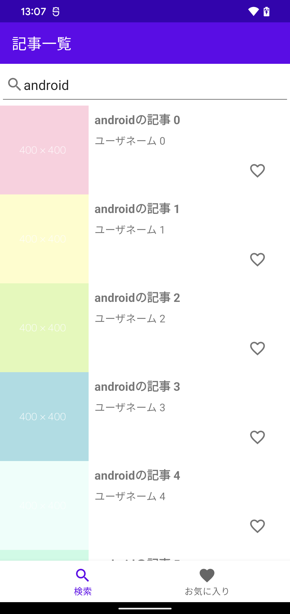
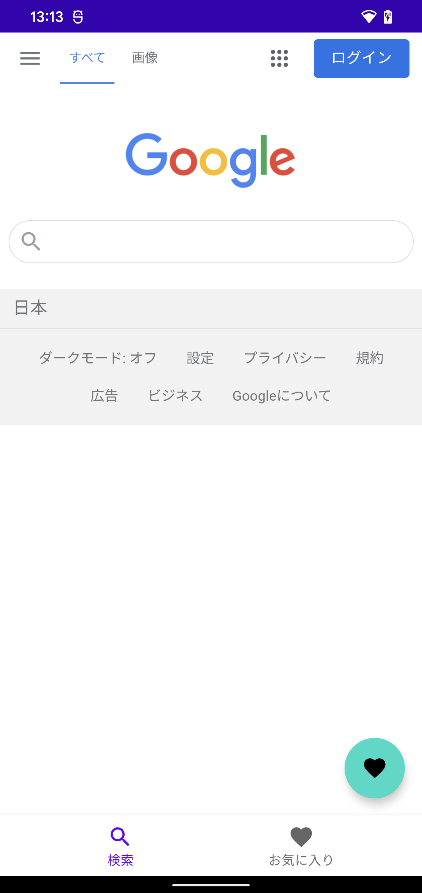
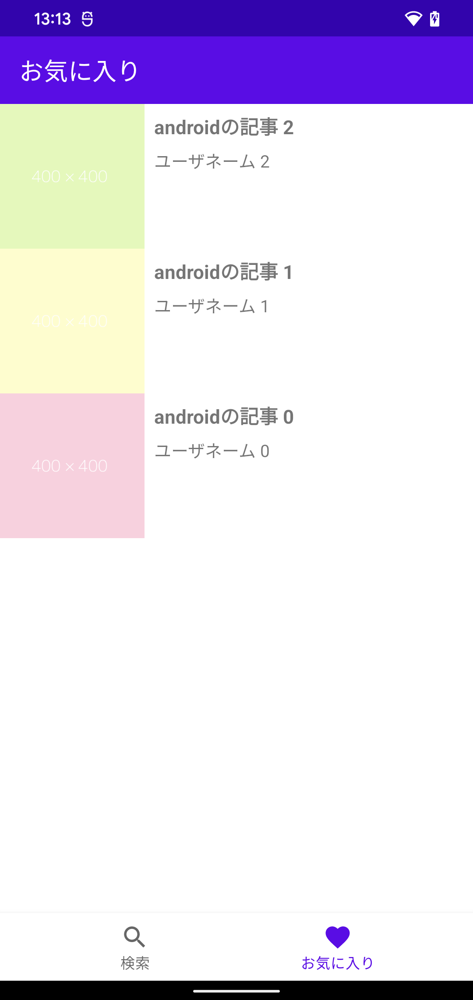
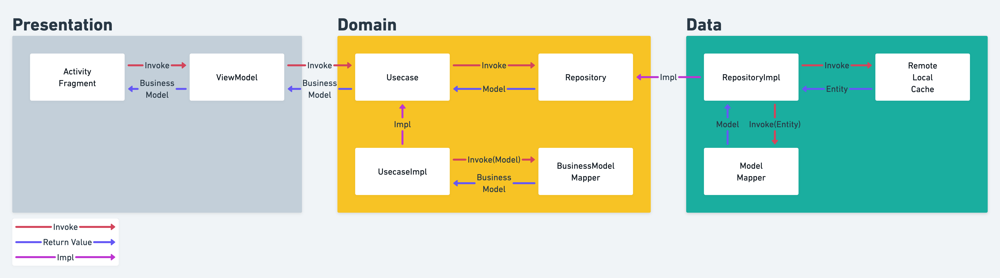

# アプリ概要

- Qiita APIを使って記事を検索・閲覧できるアプリ
- お気に入り登録機能

以下、スクショ（念のためにダミーデータを表示してます。実際にビルドした際にはQiita APIを叩くようになっています）。


## 検索画面

- 検索バーへのキーワード入力
- キーワードをもとにQiita APIを叩く
- レスポンスを一覧として表示
- 20件ずつページング
- お気に入り追加・削除
- 記事詳細画面への遷移



## 記事詳細

- 記事のURLをWebViewで表示
- お気に入り追加・削除



## お気に入り一覧

- アプリ内に保存しているお気に入り一覧表示
- 記事詳細画面への遷移



# 技術構成
- Kotlin
- Coroutine
- Flow
- Navigation
- LiveData
- Retrofit
- OkHttp3
- Dagger Hilt
- Room
- Glide

# 設計




## Domain層
- アプリケーションの振る舞いを決める層
- どこの層にも依存しない

#### Model
- Repositoryからの出力として定義
- 後に出てくるEntityと1:1の関係

#### BusinessModel
- Usecaseからの出力として定義
- Model:BusinessModel=1:Nの関係（N=1もあり得る）

#### BusinessModelMapper
- ModelからBusinessModelへの変換を定義

#### Repository
- データへのアクセス定義
- Domain層ではinterfaceのみ
- 実装はData層に書く

#### Usecase
- それぞれの振る舞いを記載
- 入力（INPUT）と出力（OUTPUT）の定義が必須
- 出力はFlow

以下はUsecaseのinterface
```kt
interface Usecase<INPUT : UsecaseInput, OUTPUT> {
    fun execute(input: INPUT): Flow<OUTPUT>
}
```

記事一覧取得[FetchArticleListUsecase](app/../domain/src/main/java/com/hir0mu/cleanarchitecture/domain/usecase/article/FetchArticleListUsecase.kt)の例

```kt
// INPUTとOUTPUTを定めたUsecaseを定義する
typealias FetchArticleListUsecase = Usecase<FetchArticleListInput, ArticleListBusinessModel>

// INPUTの定義
data class FetchArticleListInput(
    val itemId: String,
    val page: Int
) : UsecaseInput

// Usecaseの実装
class FetchArticleListUsecaseImpl(
    // 依存しているRepository
    private val articleRepository: ArticleRepository,
    private val favoriteRepository: FavoriteRepository,
    // BusinessModelへ変換するためのMapper
    private val articleMapper: ArticleBusinessModelMapper,
    private val articleListMapper: ArticleListBusinessModelMapper
) : FetchArticleListUsecase {

    companion object {
        private const val PER_PAGE = 20
    }

    /**
     * execute内で行う基本的な流れは、
     * - repositoryに対する処理を実行（例：Modelを取得）
     * - ModelなどのデータをBusinessModelへ変換
     * - emitする
     */
    override fun execute(input: FetchArticleListInput): Flow<ArticleListBusinessModel> {
        val (itemId, page) = input
        return flow {
            val articles = articleRepository.getArticles(itemId, page, PER_PAGE)
            val favs = favoriteRepository.getArticlesByIds(articles.map { it.id })
                .map { it.id }

            // 記事一覧とお気に入り情報をマージする
            val models = articles.map { model ->
                articleMapper.map(model, favs.any { model.id == it })
            }.let { articleListMapper.map(it) }

            emit(models)
        }
    }
}
```

## Data層
- DBやAPIなどのデータに対するやりとりを実装する
- Repositoryの実装を置いておく

#### Entity
- DBのカラムやAPIレスポンスを定義
- Modelと1:1の関係

#### ModelMapper
- EntityからModelへの変換を定義する

#### RepositoryImpl
- Domain層で定義したRepositoryに依存。実装を書いていく
- キャッシュ管理

```kt
// ArticleRepositoryの実装
class ArticleRepositoryImpl(
    private val api: ArticleApi,
    private val networkManager: NetworkManager,
    private val articleMapper: ArticleModelMapper
) : ArticleRepository {
    companion object {
        // キャッシュはRepositoryImplで管理
        private val detailCaches = MemoryCache<ArticleEntity>()
    }

    override suspend fun getArticles(itemId: String, page: Int, perPage: Int): List<ArticleModel> {
        return call(networkManager) { api.articles(itemId, page, perPage) }
            .let { entities ->
                // EntityからModelへの変換
                entities.map { articleMapper.map(it) }
            }
    }

    override suspend fun getArticleDetail(id: String): ArticleModel {
        return callWithCache(networkManager, id, detailCaches) { api.articleDetail(id) }
            // EntityからModelへの変換
            .let { articleMapper.map(it) }
    }
}
```

## Presentation層
- UI/UXを決める層
- 依存解決する

#### ViewModel
- Usecaseに依存
- View側からのイベントを処理
- Usecaseを呼び出し取得したデータなどをViewへ反映
- 状態管理

記事一覧のViewModel（[ArticleListViewModel](app/src/test/java/com/hiring/cleanarchitecture/view/list/ArticleListViewModelTest.kt)）の例（記事一覧取得に関係ない実装は省いています）

```kt
@HiltViewModel
class ArticleListViewModel @Inject constructor(
    // Usecaseに依存
    private val fetchArticleListUsecase: FetchArticleListUsecase,
    private val toggleFavoriteUsecase: ToggleFavoriteUsecase,
    viewModelArgs: ViewModelArgs
) : BaseViewModel(viewModelArgs) {
    companion object {
        private const val FIRST_PAGE = 1
    }

    object FetchArticleListExecution : Execution

    private val _articles: MutableLiveData<List<ArticleBusinessModel>> = MutableLiveData()
    val articles: LiveData<List<ArticleBusinessModel>> = _articles

    val searchQuery: MutableLiveData<String> = MutableLiveData("android")

    private var params = SearchParams.EMPTY
    private var isLoading = false

    val articleCount: Int?
        get() = articles.value?.size

    fun setup() {
        if (params.isEmpty()) {
            // 初回だけ記事一覧を取得する。詳細から戻ってきた時に対応
            fetchArticles(shouldReset = true)
        }
    }

    fun fetchArticles(shouldReset: Boolean = false) {
        when {
            isLoading -> return // ローディング中であれば無視
            shouldReset -> {
                // 検索バーで入力した時などのためにリセットする機能がある
                params = SearchParams(itemId = searchQuery.value.orEmpty(), page = FIRST_PAGE)
                _articles.value = listOf()
            }
            else -> {
                // リセットしないのであればページをインクリメント
                params = params.countedUp()
            }
        }
        isLoading = true

        // 記事一覧取得のためにUsecaseを呼び出す。
        fetchArticleListUsecase.execute(
            execution = FetchArticleListExecution,
            // INPUTを引数にする
            args = FetchArticleListInput(params.itemId, params.page),
            onSuccess = {
                // 成功時にここが呼ばれる
                val old = _articles.value.orEmpty()
                _articles.postValue(old.merged(it.articles))
                isLoading = false
            },
            retry = {
                isLoading = false
                fetchArticles(shouldReset)
            }
        )
    }
}
```

#### Activity・Fragment
- ViewModelに依存
- Viewからのイベントを受け取りViewModelへと伝える
- ViewModelから受け取ったデータをViewへと反映

記事一覧画面（[ArticleListFragment](app/src/main/java/com/hir0mu/cleanarchitecture/view/list/ArticleListFragment.kt))）の例（記事一覧取得に関係ない実装は省いています）

```kt
@AndroidEntryPoint
class ArticleListFragment : Fragment() {
    // ViewModelに依存
    private val viewModel: ArticleListViewModel by viewModels()
    private lateinit var binding: FragmentArticleListBinding
    private val adapter = SimpleAdapter<ItemArticleBinding>(R.layout.item_article)

    override fun onViewCreated(view: View, savedInstanceState: Bundle?) {
        super.onViewCreated(view, savedInstanceState)

        binding.articleList.adapter = adapter
        val manager = LinearLayoutManager(requireContext(), LinearLayoutManager.VERTICAL, false)
        binding.articleList.layoutManager = manager
        binding.articleList.addOnScrollListener(object : RecyclerView.OnScrollListener() {
            override fun onScrolled(recyclerView: RecyclerView, dx: Int, dy: Int) {
                // スクロール検知をしてページング
                val itemCount = viewModel.articleCount?.takeIf { it != 0 } ?: return
                if (manager.findLastVisibleItemPosition() > itemCount - 2) {
                    viewModel.fetchArticles()
                }
            }
        })

        binding.searchBar.setOnEditorActionListener { v, actionId, event ->
            when (actionId) {
                EditorInfo.IME_ACTION_SEARCH -> {
                    // 検索バーに入力後、検索ボタンを押した時に検索する
                    v.hideKeyboard()
                    viewModel.fetchArticles(shouldReset = true)
                    true
                }
                else -> false
            }
        }

        viewModel.setup()
        viewModel.articles.observe(viewLifecycleOwner) { articles ->
            // 記事一覧が流れてきたらArticleItemに変換してAdapterを更新する
            adapter.updateItems(articles.map { article ->
                ArticleItem(
                    article,
                    onItemClick = {
                        // 記事をタップしたら詳細画面へ遷移
                        val action = ArticleDetailFragmentDirections.actionToArticleDetail(it.article.id)
                        findNavController().navigate(action)
                    },
                    onCheckedChange = { /*省略*/ }
                )
            })
        }

        viewModel.loading.observe(viewLifecycleOwner) {
            when (it.execution) {
                // 記事一覧を取得中はローディングさせる
                ArticleListViewModel.FetchArticleListExecution -> binding.indicator.setVisible(it.value)
            }
        }
    }
}
```
